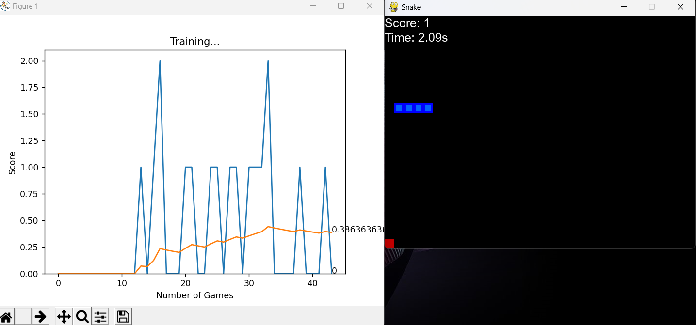

# Optimizing Game Strategies through Reinforcement Learning: A Case Study of the Snake Game

<p align="center">
  <a href="README.md">English</a> •
  <a href="README.ja_JP.md">日本語 (Japanese)</a> •
  <a href="README.zh_CN.md">简体中文 (Simplified Chinese)</a> 
</p>

You are in ddqn branch!

## Overview

This research focuses on the application of reinforcement learning to the development of game strategies, using the classic game of Snake as a case study. The goals of the research include developing AI agents that can effectively play the game, comparing the effectiveness of different reinforcement learning algorithms, and exploring the potential of these techniques in the broader AI domain. Three algorithms, DQN, Double DQN, and Dueling DQN, were used to train the AI agents in a simulated environment, and several performance metrics were set. The research aims to deepen the understanding of the application of reinforcement learning in game strategy development, provide a framework for more complex scenarios, and drive the development of more adaptive AI systems.

## Viewing Code Implemented by Different Algorithms

You can view the code for different algorithm implementations by switching branches:

- [main](https://github.com/chenxingxu3/snake-ai-pytorch/tree/main): DQN algorithm

- [ddqn](https://github.com/chenxingxu3/snake-ai-pytorch/tree/ddqn): Double DQN algorithm

- [DuelingDQN](https://github.com/chenxingxu3/snake-ai-pytorch/tree/DuelingDQN): Dueling DQN algorithm

## Creating a runtime environment in CONDA

Creating an environment from `snake-ai-pytorch.yml` file: 

```shell
conda env create -f snake-ai-pytorch.yml
```

Activate the new environment: `conda activate snake-ai-pytorch`

Verify that the new environment was installed correctly: 

```shell
conda env list
```

You can also use`conda info --envs`

For more information, please visit: [CONDA User guide  > Managing environments](https://conda.io/projects/conda/en/latest/user-guide/tasks/manage-environments.html)

## Creating a runtime environment in ANACONDA [recommended]

ANACONDA download at [https://www.anaconda.com/download](https://www.anaconda.com/download)

Start `ANACONDA.NAVIGATOR` and import `snake-ai-pytorch.yml` in `Environments` > `Import`


## Run the game and start the training process

Run `agent.py` using Python:

```shell
python agent.py
```

Screenshot of the game running:



## Results of the training

You can view the training results in the `results` directory.

## Video recording of training process (1,000 episodes)

- DQN：[AI learns to play Snake Game using Deep Q Learning over 1000 episodes](https://odysee.com/@Xingxu:4/snake-dqn-1000-episodes:5?r=3voigLSm5Gk2uFYiE7h2PoseeErFC63k)

- Double DQN：[AI learns to play Snake Game using Double DQN over 1000 episodes](https://odysee.com/@Xingxu:4/snake-ddqn-1000-episodes:6?r=3voigLSm5Gk2uFYiE7h2PoseeErFC63k)

- Dueling DQN：[AI learns to play Snake Game using Dueling DQN over 1000 episodes](https://odysee.com/@Xingxu:4/snake-duelingdqn-1000-episodes:3?r=3voigLSm5Gk2uFYiE7h2PoseeErFC63k)

## Referenced code

The design of the Snake game and the implementation of the DQN algorithm references code from the following project:

[GitHub - patrickloeber/snake-ai-pytorch](https://github.com/patrickloeber/snake-ai-pytorch)

The implementation of Double DQN and Dueling DQN algorithms references code from the following project:

[GitHub - p-christ/Deep-Reinforcement-Learning-Algorithms-with-PyTorch: PyTorch implementations of deep reinforcement learning algorithms and environments](https://github.com/p-christ/Deep-Reinforcement-Learning-Algorithms-with-PyTorch)
